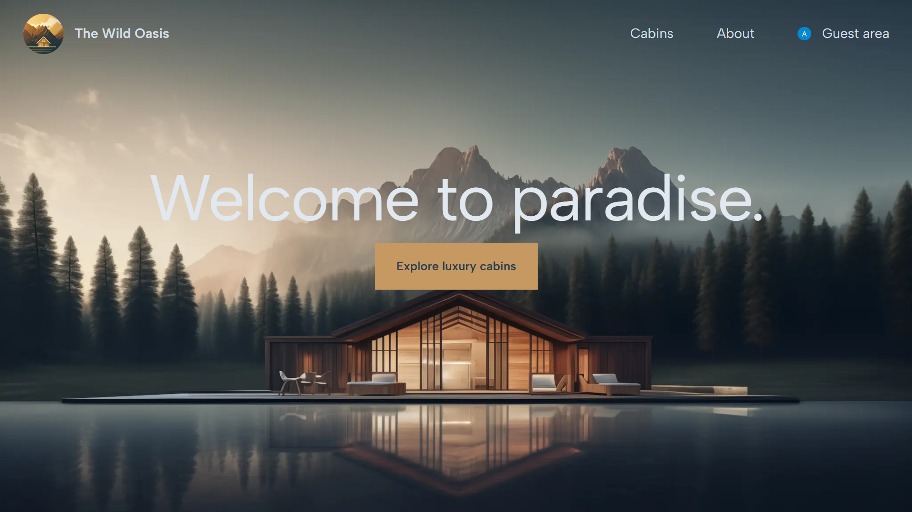
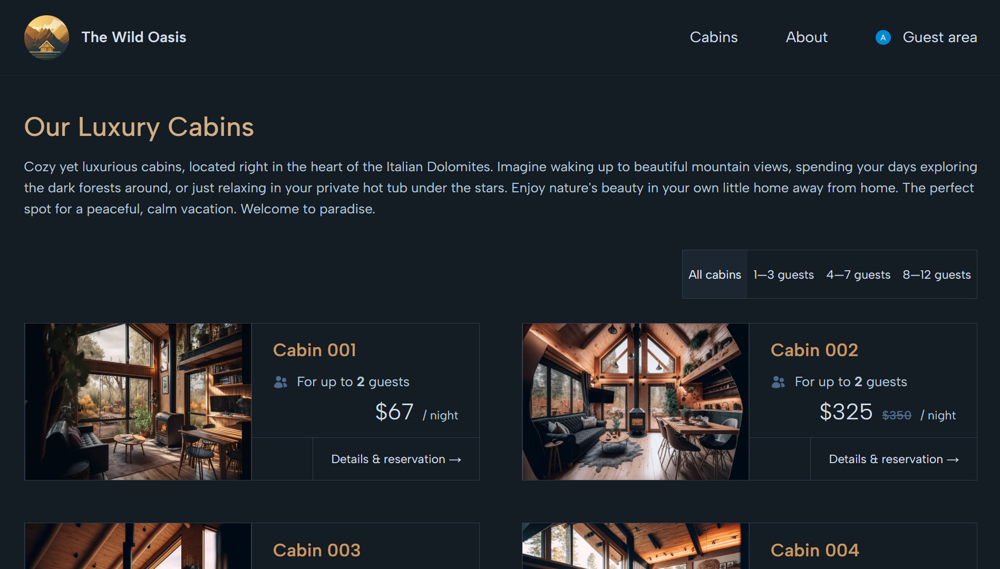
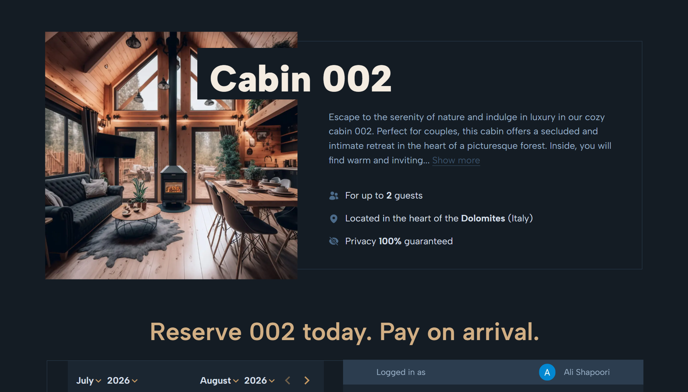
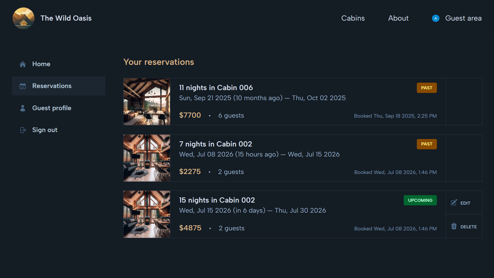

# The Wild Oasis — Customer-Facing App

<p align="center">
  Modern cabin rental experience for browsing, booking, and managing stays.
</p>

<p align="center">
  
  
  
  
  
  
</p>

---

## About

The **Wild Oasis Customer-Facing App** is a modern cabin rental web application built for guests who want to explore,
reserve, and manage stays at The Wild Oasis.

It provides a clean and intuitive experience for:

- Browsing luxury cabins
- Viewing detailed cabin information
- Authenticating securely with Google
- Creating and managing reservations
- Maintaining a personal guest profile

This application is the **customer-facing side of The Wild Oasis ecosystem**, designed with performance, scalability,
and real-world usability in mind.

**Developed by Ali Shapoori**

---

## Overview

The app allows users to:

- Discover available cabins
- Filter cabins by guest capacity
- View detailed cabin pages
- Reserve cabins for selected dates
- Manage reservations from a protected account area

It integrates tightly with a Supabase backend to ensure consistent data handling for cabins, bookings, guests, and
application settings.

---

## Live Demo

```
https://your-live-app-url.com
```

---

## Screenshots

<p align="center">  </p>

<p align="center">  </p>

<p align="center">  </p>

<p align="center">  </p>

---

## Key Features

### Cabin Experience

- Browse luxury cabins with rich details
- View pricing, capacity, images, and descriptions
- Filter cabins by guest capacity

### Reservation System

- Date-based booking flow
- Prevent reservations on already booked date ranges
- Reservation confirmation flow

### Authentication & User System

- Google authentication via NextAuth
- Automatic guest profile creation on first sign-in
- Persistent authenticated sessions

### Guest Dashboard

- Protected account area
- View existing reservations
- Update future reservations
- Delete future reservations
- Manage guest profile details for smoother check-in

### Architecture & UX

- Supabase-powered backend
- Responsive, modern UI
- Server-side data fetching
- Server Actions using Next.js App Router

---

## Tech Stack

| Category         | Technology                 |
| ---------------- | -------------------------- |
| Framework        | Next.js (App Router)       |
| Language         | TypeScript                 |
| Frontend         | React, Tailwind CSS        |
| Authentication   | NextAuth (Google)          |
| Backend / DB     | Supabase                   |
| State Management | Redux Toolkit, React Redux |
| Date Handling    | date-fns, React DayPicker  |
| Icons            | Heroicons                  |
| Linting          | ESLint                     |

---

## Project Structure

```
.
├── app
│   ├── _components   # Reusable UI components
│   ├── _lib          # Data services, auth, store, actions, Supabase client
│   ├── _styles       # Global styles
│   ├── about         # About page
│   ├── account       # Protected guest account pages
│   ├── api           # API and authentication routes
│   ├── cabins        # Cabin listing, details, reservation flow
│   ├── login         # Sign-in page
│   ├── layout.tsx    # Root layout
│   └── page.tsx      # Home page
├── public            # Static assets
├── types             # TypeScript definitions
├── next.config.ts    # Next.js configuration
├── proxy.ts          # Authentication proxy configuration
├── package.json
└── tsconfig.json
```

---

## Getting Started

### Prerequisites

- Node.js
- npm

---

### Installation

```bash
git clone https://github.com/alish-shady/The-Wild-Oasis-Customer-Facing-App.git
cd The-Wild-Oasis-Customer-Facing-App
npm install
```

---

## Environment Variables

Create a `.env.local` file:

```env
SUPABASE_URL=your_supabase_project_url
SUPABASE_KEY=your_supabase_key

AUTH_GOOGLE_ID=your_google_oauth_client_id
AUTH_GOOGLE_SECRET=your_google_oauth_client_secret
AUTH_SECRET=your_auth_secret

RESTCOUNTRIES_KEY=your_restcountries_api_key
```

> The application expects a configured Supabase project with:
>
> - cabins
> - bookings
> - guests
> - settings
> - cabin image storage

---

## Running the App

```bash
npm run dev
```

Open:

```
http://localhost:3000
```

---

## Scripts

```bash
npm run dev     # Development server
npm run build   # Production build
npm run start   # Production server
npm run prod    # Build + start production
npm run lint    # Lint project
```

---

## Routes Overview

| Route                   | Description                        |
| ----------------------- | ---------------------------------- |
| `/`                     | Home page                          |
| `/about`                | About The Wild Oasis               |
| `/cabins`               | Cabin listing and filtering        |
| `/cabins/[cabinId]`     | Cabin details and reservation flow |
| `/cabins/thankyou`      | Reservation confirmation page      |
| `/login`                | Google sign-in page                |
| `/account`              | Protected guest dashboard          |
| `/account/reservations` | Guest reservations                 |
| `/account/profile`      | Guest profile management           |

---

## Authentication

The application uses **Google OAuth via NextAuth**.

- After sign-in, the system checks if the user exists
- If not, a new guest profile is automatically created
- Returning users are recognized and loaded

Protected routes ensure that only authenticated users can access:

- Reservations
- Profile information

---

## Database

The app communicates with Supabase to manage:

- Cabin data
- Cabin pricing and capacity
- Guest records
- Booking records
- Booked date ranges
- Application settings

### Reservation Logic

- Prevents double booking of cabins
- Prevents updating or deleting past reservations
- Ensures consistent booking state across users

---

## Deployment

This is a Next.js application and can be deployed to:

- Vercel
- Netlify
- Any Node.js-supported hosting environment

Before deploying, ensure all production environment variables are configured.

---

## Author

**Ali Shapoori** Web Developer

GitHub: https://github.com/alish-shady

---
